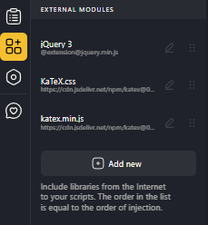
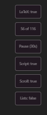
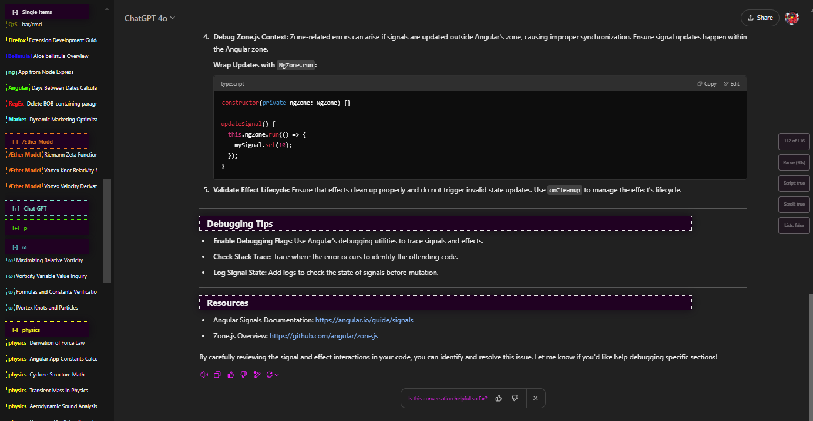

### This is my Javascript + SCSS that can be used with  
Chrome Extention: User JavaScript and CSS: https://tenrabbits.github.io/user-js-css-docs/  
Developer mode is now mandatory, it's a Google requirement for the UserScripts extension  

#### Categorize by rename chats and writing between brackets like so: [catagory]
   

## For the katex rendering to work you have to add as external modules:  
KaTeX.js: https://cdn.jsdelivr.net/npm/katex@0.16.8/dist/katex.min.js  
KaTeX.css:https://cdn.jsdelivr.net/npm/katex@0.16.0/dist/katex.min.css

|  |  |
|------------------------------------------------------------------------------------------------------------------------|---------------------------------------------------------------------------------------------------------------------------------------|
|           |                                                                                                                |
                                                                                                            |

#### 

#### 

---

## Shorts Auto-Advance Extension – Permissions Rationale

The Chrome extension portion (Shorts Auto-Advance) requests a minimal set of permissions needed for reliable, low-friction auto-advancing of YouTube Shorts. Below is a plain-language justification:

1. `host_permissions`: `https://www.youtube.com/*`, `https://youtube.com/*`
   - Why: Allows the content script to run on Shorts pages and lets the background service worker read the URL of YouTube tabs (needed to detect if the active tab is a Shorts video and to decide when to animate the icon). Without host permissions, dynamic injection and URL-based logic would fail or require broader `tabs` permission.
   - Scope Control: Restricted only to YouTube origins; no other sites are accessible.

2. `scripting`
   - Why: Used in `background.js` with `chrome.scripting.executeScript` to (a) inject the `content.js` on navigation commits where the static `content_scripts` match might miss due to early SPA transitions, and (b) perform a lightweight check (`window.__SHORTS_AUTO_ADVANCE_LOADED`) before injecting to prevent duplicates.
   - Benefit: Guarantees the logic attaches even if YouTube changes internal routing or delays DOM availability.

3. `webNavigation`
   - Why: Enables listening to `chrome.webNavigation.onCommitted` events. This is critical for YouTube’s SPA behavior (fast client-side route changes) where relying solely on URL polling or `tabs.onUpdated` can occasionally miss the precise moment needed to inject before playback starts.
   - Optionality: Could be removed if we accept a small risk of missed injections and rely on slower polling; kept for robustness.

4. `contextMenus`
   - Why: Provides the right-click menu on the extension icon to quickly toggle enable/disable and switch repeat mode (0, 1, or 2 loops) without a popup UI or persistent storage. Reduces UI surface while retaining user control.
   - UX Advantage: Avoids adding a popup or page permission; everything is accessible in the native Chrome UI.

### Privacy & Data Handling
- No network requests, analytics, or external data exfiltration.
- No storage permission: State (enabled + repeat count) lives only in memory for the session; resets on browser restart.
- No access to cookies, history, or broader tab data beyond the permitted YouTube origins.

### Can Any Permission Be Dropped?
- Dropping `webNavigation`: Possible, but may cause occasional missed auto-advance after rapid SPA navigations.
- Dropping `scripting`: Not recommended—dynamic injection fallback would break; only static matches would be available.
- Dropping `contextMenus`: Would remove the lightweight control surface; we’d need a popup or keyboard shortcuts instead.
- Dropping `host_permissions`: Not feasible; content script and URL checks rely on YouTube origin access.

### Security Practices
- Double-injection guard (`window.__SHORTS_AUTO_ADVANCE_LOADED`) prevents repeat listener registration.
- Debounced loop detection avoids aggressive media control.
- Only minimal DOM queries for navigation buttons and video elements; no scraping of user data.

If YouTube navigation stabilizes further, a future “reduced permission” variant could remove `webNavigation` and rely solely on static `content_scripts` plus tab URL polling.

---